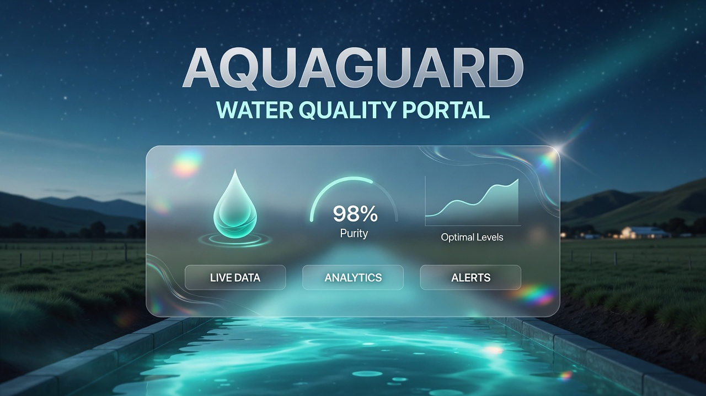
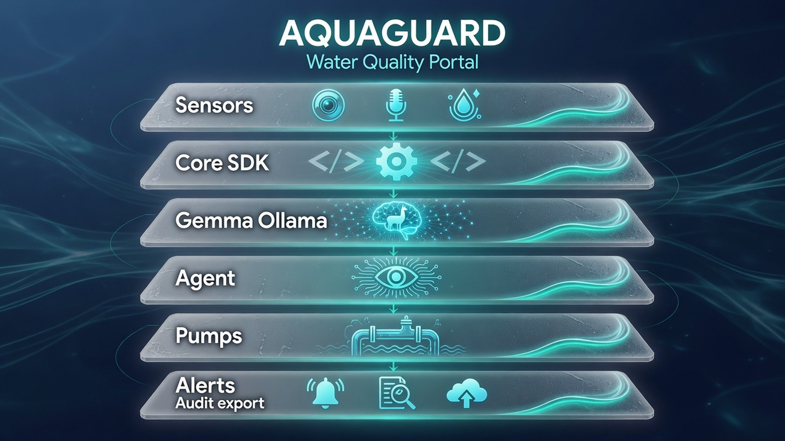
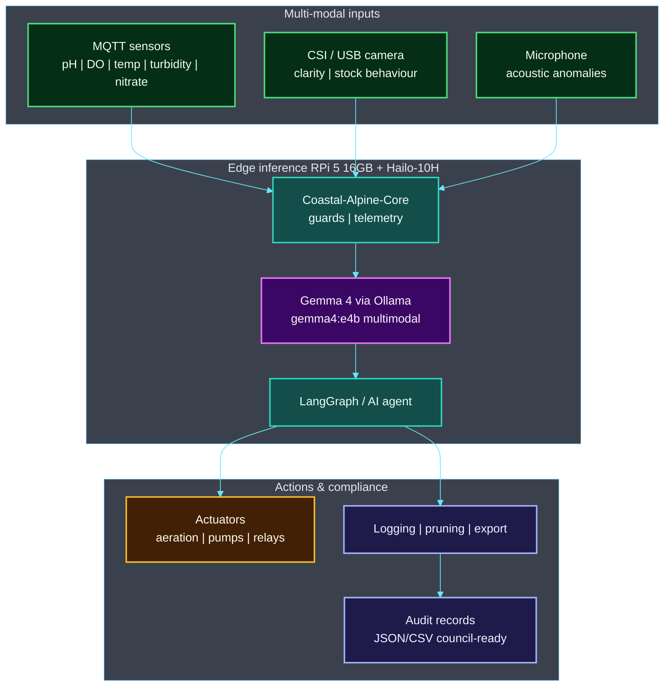

# AquaGuard Portal

[](./COMPLIANCE.md)
[](./SECURITY.md)
[](./COMPLIANCE.md)


<!-- BEGIN CAT_CONGRUENCE_SNIPPET -->
## Coastal Alpine Tech portfolio

[](https://github.com/fivepanelhat/fivepanelhat)
[](https://github.com/fivepanelhat/fivepanelhat)
[](./.github/agent-fleet/AGENTS.md)
[](https://github.com/fivepanelhat/fivepanelhat)

**Part of the [Kiwi Edge AI Stack](https://github.com/fivepanelhat/fivepanelhat)** | Founder OS: [NZ-Start-Up](https://github.com/fivepanelhat/NZ-Start-Up) | Agent policy: [`.github/agent-fleet/`](./.github/agent-fleet/)

> Sovereign hybrid edge AI for NZ farms and founders - local-first + multi-model, Te Mana Raraunga aligned - collaborating with Venture Taranaki, startups.com investors and Kotahitanga Investment Fund (HITL + cultural advisory for formal approaches).

**Agents inform, draft, prepare, monitor, and remind. Humans advise, sign, file, send, and pay.** 
Anti-hallucination policy: [`.github/agent-fleet/anti-hallucination.md`](./.github/agent-fleet/anti-hallucination.md) | Congruence: [`CAT_CONGRUENCE.md`](./CAT_CONGRUENCE.md)
<!-- END CAT_CONGRUENCE_SNIPPET -->

<!-- BEGIN PRIVACY_SECURITY_GOVERNANCE -->
## Privacy · Security · Governance

Coastal Alpine Tech products treat operational and personal data as **taonga**. Defaults favour **local-first** operation, **purpose-limited** collection, and **Human-in-the-Loop** for high-stakes actions.

| Pillar | Commitment |
| :--- | :--- |
| **Privacy** | Local-first / offline-capable where practical; Privacy Act 2020 awareness; cloud and third-party AI only when **opt-in and labelled** |
| **Security** | No silent exfiltration of tenant or personal data; owner-controlled keys; SecOps / dependency hygiene on the fleet cadence |
| **Governance** | Agents **inform, draft, prepare**; humans **advise, sign, file, send, and pay**. Te Mana Raraunga spirit for Māori data sovereignty |

**Agents inform, draft, prepare, monitor, and remind. Humans advise, sign, file, send, and pay.**

Fleet policy: [fivepanelhat / Kiwi Edge AI Stack](https://github.com/fivepanelhat/fivepanelhat) · Product detail: [`COMPLIANCE.md`](./COMPLIANCE.md) · [`SECURITY.md`](./SECURITY.md) (where present) · [`CAT_CONGRUENCE.md`](./CAT_CONGRUENCE.md) (where present)
<!-- END PRIVACY_SECURITY_GOVERNANCE -->


<!-- BEGIN PROBLEMS_SOLUTIONS_ECONOMY -->
## Problems we are solving

**AquaGuard** brings offline multi-modal water / runoff monitoring to NZ farms and aquatic sites.

1. **Connectivity gaps** - Coastal and rural sites lose internet; compliance logging cannot stop.
2. **Fragmented water parameters** - pH, DO, turbidity, nitrate, and vision are rarely fused in real time.
3. **Regulatory burden** - NES-F, farm plans, and regional consents need auditable local records.
4. **Te Mana o te Wai** - Freshwater decisions require data custody that respects tangata whenua standing.

## Solution we have built

| Built capability | What it does |
| :--- | :--- |
| **Edge portal** | MQTT sensors + AV + local Gemma/Ollama analysis |
| **Compliance export** | JSON/CSV records oriented to council reporting |
| **Offline operation** | Continues through rural blackouts |
| **Stack fit** | Built on Coastal-Alpine-Core; sister to Byte Size Kai / SoilGuard |

### Local (Taranaki) and national (Aotearoa) economic benefits

| Lever | Benefit |
| :--- | :--- |
| **Regional R&D HQ** | Product design and IP stay in New Plymouth / Taranaki - not only Auckland/offshore SaaS |
| **Primary-sector productivity** | On-farm and rural tools aim to cut waste, protect consents, and support export competitiveness |
| **Skilled employment pathways** | Edge install, field support, agritech ops, software, compliance, and cultural advisory roles as pilots scale |
| **Data sovereignty** | Te Mana Raraunga-aligned local custody keeps high-value operational data onshore |
| **HITL jobs quality** | Agents **inform / draft / prepare / monitor / remind**; humans **advise / sign / file / send / pay** - augment people, do not fake full autonomy |

**Stage honesty (pre-seed):** Impact today is founder R&D, near-term contractors, and EDA/partner leverage. Permanent multi-region payroll follows paid pilots and revenue - we do not invent headcount claims.
<!-- END PROBLEMS_SOLUTIONS_ECONOMY -->

[](./LICENSE)
[](https://www.python.org)
[](https://ollama.com)

[](https://github.com/fivepanelhat/AquaGuard-Portal)
[](https://github.com/fivepanelhat/AquaGuard-Portal)
[](https://github.com/fivepanelhat/AquaGuard-Portal)
[](https://github.com/fivepanelhat/AquaGuard-Portal)

[](https://anthropic.com)
[](https://gemini.google.com)
[](https://openai.com)
[](https://x.ai)

[](https://github.com/fivepanelhat/AquaGuard-Portal)
[](https://mosquitto.org)
[](https://github.com/fivepanelhat/AquaGuard-Portal)
[](https://www.eeca.govt.nz)

[](https://github.com/fivepanelhat/AquaGuard-Portal/actions/workflows/ci-scan.yml)
[](https://github.com/fivepanelhat/AquaGuard-Portal/actions/workflows/secops.yml)
[](https://github.com/fivepanelhat/AquaGuard-Portal/actions/workflows/redteam.yml)
[](https://github.com/fivepanelhat/AquaGuard-Portal/security/dependabot)



**Coastal Alpine Tech Limited** pre-seed startup, New Plymouth, Taranaki, Aotearoa New Zealand.
*Edge AI | Sovereign Systems | Practical Intelligence*

Autonomous on-premise multi-modal environmental and water quality monitoring system for New Zealand aquaculture and dairy farms using edge AI. Designed for full offline operation in remote coastal and rural environments.

---

## The 5 Ws: Project Context

- **Who:** Built by Coastal Alpine Tech Limited, for collaboration with (pre-seed; relationships in development) NZ aquaculture operators, dairy farmers, and tangata whenua with interests in freshwater and coastal environments.
- **What:** A multi-modal, agentic IoT pipeline that ingests sensor telemetry, visual, and acoustic data to autonomously monitor water quality, detect anomalies, optimise operations, and generate audit-ready compliance records.
- **Where:** Deployed on-site for marine aquaculture operations (mussel, salmon, oyster farms), land-based aquaculture, or dairy effluent management systems. Engineered at HQ in New Plymouth, Taranaki.
- **When:** Active development as of June 2026.
- **Why:** To deliver localised data sovereignty and real-time decision intelligence without cloud latency or privacy risks in New Zealand's remote or regulated aquatic environments. Compliance record-keeping is built into the data model from day one.

---


---

## Key Features

- Multi-modal input processing (MQTT water sensors, underwater/above-water cameras, microphone)
- Local Gemma 4 inference via Ollama multimodal (text + image) for analysis, prediction, and control
- Edge-native execution with full offline capability
- Automated data logging and media pruning
- Deterministic outputs via Pydantic schemas
- Compliance record export (JSON + CSV) formatted for regional council reporting
- Systemd service for persistent, unattended operation
- Hardware control (aeration, pumps, alert relays, effluent management)
- Audit trail generation compatible with Freshwater Farm Plan requirements

---

## Quick Start

### Prerequisites

#### Hardware (NZ-available)

- Raspberry Pi 5 (16GB RAM) available from [PB Tech](https://www.pbtech.co.nz) and [Kiwi Electronics](https://www.kiwi-electronics.com)
- **Raspberry Pi AI Accelerator / AI HAT+ 2** (40 TOPS, Hailo-10H NPU) available from [PB Tech](https://www.pbtech.co.nz/product/SEVRBP0545) and Kiwi Electronics
 *Canonical target: AI HAT+ 2 / Hailo-10H (40 TOPS) for multi-model and generative workloads*
- Water quality sensors (pH, DO, temperature, turbidity) via ESP32 over MQTT
- CSI or USB camera module (appropriate IP67/IP68 underwater housing for aquatic deployment)
- Hydrophone or directional microphone (optional, for acoustic anomaly detection)
- Python 3.10+
- Ollama with Gemma 4 edge model
- Local MQTT broker (Mosquitto)

> **Canonical edge target:** **Raspberry Pi 5 (16GB)** with **Hailo-10H NPU** (40 TOPS) via the Raspberry Pi AI Accelerator / AI HAT+ 2. Available in New Zealand via PB Tech and Kiwi Electronics.

### Installation & Setup

We provide separate guides for system environment setup and installation for Windows and Linux users:

* **Prerequisites & System Setup Guide**: Read [setup.md](setup.md)
* **Installation Guide**: Read [installation.md](installation.md)

### Quick Start (Automated Setup)
The fastest way to install is running the cross-platform bootstrap script:

```bash
python bootstrap.py
```

d-Portal
python bootstrap.py
```

### Manual Installation

<details open>
<summary><strong> Linux / macOS (Bash)</strong></summary>

```bash
git clone https://github.com/fivepanelhat/AquaGuard-Portal.git
cd AquaGuard-Portal

python3 -m venv venv
source venv/bin/activate

# Install shared core and dependencies
pip install git+https://github.com/fivepanelhat/coastal-alpine-core.git@v0.2.0
pip install -r requirements.txt
pip install -r requirements-dev.txt
cp .env.example .env
```

</details>

<details>
<summary><strong> Windows (PowerShell)</strong></summary>

```powershell
git clone https://github.com/fivepanelhat/AquaGuard-Portal.git
cd AquaGuard-Portal

python -m venv venv
.\venv\Scripts\Activate.ps1

# Install shared core and dependencies
pip install git+https://github.com/fivepanelhat/coastal-alpine-core.git@v0.2.0
pip install -r requirements.txt
pip install -r requirements-dev.txt
Copy-Item .env.example .env
```

> **Note:** If you receive an execution policy error, run `Set-ExecutionPolicy -Scope CurrentUser RemoteSigned` first.

</details>

### Model Setup & Validation

```bash
ollama serve # In one terminal
ollama pull gemma4:e4b # Efficient 4B recommended for RPi 5 (16GB RAM)
# Alternative for AI HAT+ 2 (40 TOPS): ollama pull gemma4:12b
python validate.py
```

> **Model selection note:** `gemma4:e4b` is the recommended tag for Raspberry Pi 5 deployments. Gemma 4 is multimodal it accepts both text and image input, enabling direct camera frame analysis without a separate vision pipeline. Do not use `gemma4:latest` as a tag in production; pin to an explicit variant for reproducibility.

### Running the Portal

```bash
python main.py
```

**Expected validation output:** Sensor connectivity, inference, and control tests pass.

---

## Architecture Overview

> **Diagrams:** Architecture images and Mermaid maps describe the **target product architecture** for this pre-seed stack. They are engineering design maps not claims of large-scale commercial fleet deployment.

AquaGuard is a closed-loop **water quality and aquaculture** edge agent. Multi-modal inputs feed local Gemma 4 (Ollama) on **RPi 5 16GB + Hailo-10H**; actuators and council-ready audit exports stay on-premise.



### System map



 | Layer | Components | Role |
 | :--- | :--- | :--- |
 | **Inputs** | MQTT + camera + mic | Multi-modal farm / marine capture |
 | **Core** | Coastal-Alpine-Core | Shared safety + telemetry |
 | **Reasoning** | Gemma 4 e4b local | Offline multimodal LLM |
 | **Actuation** | Pumps | aeration | alerts | Closed-loop control |
 | **Compliance** | Local JSON/CSV export | Council-ready audit trail |

*Full detail: [ARCHITECTURE.md](./ARCHITECTURE.md) | [HARDWARE_SETUP.md](./HARDWARE_SETUP.md)*

## Directory Structure

```bash
AquaGuard-Portal/
|-- portal_core/ # Core engine (ai_agent.py, mqtt_client.py, compliance_exporter.py, etc.)
|-- portal_schemas/ # Pydantic models (including compliance record schemas)
|-- telemetry_data/ # Local logs, media buffers, and compliance exports
|-- tests/
|-- main.py
|-- validate.py
|-- requirements.txt
|-- requirements-dev.txt
|-- .env.example
|-- aquaguard.service # Systemd service
|-- ARCHITECTURE.md
|-- COMPLIANCE.md # NZ regulatory mapping and record-keeping guide
-- README.md
```

---

## Technology Stack

### Hardware

- Raspberry Pi 5 (16GB) + Raspberry Pi AI Accelerator / AI HAT+ 2 (Hailo-10H NPU, 40 TOPS)
- Water quality sensors (pH, DO, temperature, turbidity, nitrate), ESP32 MQTT gateway
- Camera modules with aquatic IP-rated housing; optional hydrophone

### Software

- **Orchestration:** LangGraph agentic pipeline
- **Inference:** Ollama + Gemma 4 (`gemma4:e4b` for edge; multimodal text + image)
- **Messaging:** Paho MQTT + Mosquitto broker
- **Schemas:** Pydantic (deterministic JSON outputs)
- **Capture:** OpenCV / PyAudio
- **Compliance export:** Custom CSV/JSON formatter aligned to NES-F and regional council reporting formats
- **Deployment:** Systemd, Docker-ready

---

## New Zealand Regulatory & Compliance Framework

This section maps AquaGuard Portal's data outputs to the key NZ regulatory instruments operators must satisfy. AquaGuard is not a substitute for professional environmental or legal advice consult your regional council and a qualified environmental consultant for site-specific consent conditions.

### Primary Legislation

 | Instrument | Relevance to AquaGuard |
 | --- | --- |
 | Resource Management Act 1991 (RMA) | Foundational environmental framework under transition. Draft Natural Environment Bill and Planning Bill introduced in December 2025 (public consultation closed February 2026). AquaGuard is designed to adapt to the incoming Natural Environment Bill framework. |
 | Fisheries Act 1996 | Governs land-based aquaculture licensing; marine farmers must be on the MPI Fish Farmer Register |
 | Biosecurity Act 1993 | Aquatic pest/disease surveillance; AquaGuard acoustic and visual anomaly logs support early detection obligations under the Government Industry Agreement (GIA) |
 | Privacy Act 2020 | All on-device data storage supports sovereign data obligations; no personal data transmitted off-site |

### National Environmental Standards

**NES for Freshwater (NES-F 2020)**
Resource Management (National Environmental Standards for Freshwater) Regulations 2020 the core compliance instrument for dairy effluent. Note that while December 2025 amendments (effective January 2026) streamlined quarrying/mining consenting, core agricultural effluent and Te Mana o te Wai rules remain fully active.

- Dairy effluent systems must comply 365 days per year under permitted activity rules
- Resource consent required for intensive operations (feedlots, certain irrigation areas exceeding 10ha)
- AquaGuard generates continuous timestamped sensor records suitable for council inspection and nitrogen-reporting obligations
- Integration with DairyNZ Effluent Warrant of Fitness (WoF) assessments: AquaGuard telemetry logs support WoF documentation requirements

**NES for Marine Aquaculture (NES-MA)**
National Environmental Standards for Marine Aquaculture core instrument for marine farming. The **NES-MA Amendments came into effect on 4 June 2026**, streamlining the re-consenting process and clarifying conditions for existing marine farms to reduce consenting barriers.

- Regional councils responsible for consenting within the coastal marine area (012 nautical mile limit)
- AquaGuard water quality logs support Environmental Monitoring and Operations Plans (EMOPs) embedded in consent conditions
- AquaGuard's configurable compliance export module is designed to accommodate these streamlined 2026 reporting requirements

### Freshwater Farm Plans

Resource Management (Freshwater Farm Plans) Regulations 2023 mandatory plans for farms in designated Freshwater Management Units (FMUs).

- Nationwide rollout paused in late 2024 (except the active **Southland Region**) pending RMA reform.
- The **August 2025 Resource Management (Consenting and Other System Changes) Amendment Act** updated the system to allow closer integration with industry assurance programmes, enabling approved industry organisations to appoint certifiers and auditors alongside regional councils.
- AquaGuard's compliance export generates structured JSON/CSV records of sensor events, thresholds breached, and automated responses serving as verified, auditor-ready evidence of plan implementation.

### Land-Based Aquaculture

Freshwater Fish Farming Regulations 1983 (under Fisheries Act 1996) apply to all aquaculture above the high-tide mark, including recirculating aquaculture systems (RAS) and farms using pumped seawater. A fish-farm licence from MPI is required for listed species.

### Regional Council Obligations

AquaGuard is designed to support site-specific permitted activity rules across all major NZ regional councils, including:

- **Horizons Regional Council** (Manawatu-Whanganui, including Taranaki border catchments)
- **Waikato Regional Council** Waikato Regional Plan Rule **3.5.5.1** permitted activity conditions for discharging farm dairy effluent to land (requiring that no effluent enters surface water or causes surface ponding). AquaGuard's continuous sensor monitoring and pump shutoff relays provide direct, auditable proof of compliance.
- **Environment Canterbury (ECan)**
- **Otago Regional Council (ORC)**
- **Environment Southland**

Operators must verify their specific permitted activity thresholds with their regional council. AquaGuard's `.env` file includes configurable threshold parameters to match site-specific consent conditions.

### Tangata Whenua & Te Mana o te Wai

The National Policy Statement for Freshwater Management 2020 (NPS-FM) establishes the *Te Mana o te Wai* hierarchy, giving first priority to the health and wellbeing of freshwater bodies a legal framing that reflects tikanga Maori values for wai (water).

- Resource consent conditions in many regions now include effects assessments on tangata whenua values and practices (e.g., Northland Regional Council's proposed effluent consent conditions)
- AquaGuard's sovereign data architecture ensures monitoring data generated on or near whenua Maori remains under the control of the operator and, where agreed, accessible to the relevant iwi or hapu
- This aligns with *Te Mana Raraunga* (Maori Data Sovereignty) principles and supports operators in demonstrating culturally appropriate environmental kaitiakitanga through documented, auditable evidence

For projects on or adjacent to Maori land or within customary fisheries areas, early engagement with the relevant iwi authority is strongly recommended before deployment.

---

## Real-World Deployment Examples

**Marine Aquaculture Mussel and Salmon Farms (NES-MA)**
Deployed at coastal marine sites to monitor dissolved oxygen, temperature, and turbidity. Automated aeration or alert triggering during low-oxygen events. Water quality records fed into EMOP reporting required under resource consent conditions. All data remains on-device; no cloud transmission required to meet MPI reporting obligations.

**Dairy Farm Effluent Management (NES-F 2020 / Regional Plan Permitted Activity)**
Continuous monitoring of effluent treatment ponds pH, DO, temperature with timestamped logs for 365-day compliance. Automated alerts and actuator control (pump management) in response to threshold breaches. Compliance export module generates records suitable for council inspection, DairyNZ WoF documentation, and Freshwater Farm Plan audit evidence.

**Land-Based Aquaculture Recirculating Systems (Freshwater Fish Farming Regulations 1983)**
Deployed in RAS facilities (salmon, trout, whitebait ranching) where water parameter precision is critical. Gemma 4 multimodal inference analyses camera feeds for stock behaviour anomalies alongside sensor data. Fish-farm licence compliance supported through continuous parameter logging.

**Conservation & Wetland Restoration**
Integrated into ecological restoration sites wetlands, riparian plantings, kaitiakitanga monitoring programmes for real-time biodiversity and water health tracking. Suitable for iwi-led environmental monitoring with full data sovereignty.

### Implementation Notes

- Assemble hardware per [HARDWARE_SETUP.md](./HARDWARE_SETUP.md) with IP67/IP68-rated enclosures for any components in or near water
- Calibrate water quality sensors against known standards before deployment; recalibrate per manufacturer schedule (typically 36 months for DO probes, 12 months for pH)
- Configure consent-specific thresholds in `.env` before go-live
- Deploy via `aquaguard.service` for automatic startup and watchdog restart
- Run `validate.py` in a test tank or pond before full deployment
- Engage your regional council compliance team before deployment to confirm that AquaGuard's log format meets their inspection requirements for your specific consent conditions
- Combine with existing Blue-Moon-Portal components for hybrid land-water systems

---

## Performance & Benchmarks

- Sub-second local inference on RPi 5 + AI HAT+ (40 TOPS Hailo-10H NPU)
- `gemma4:e4b` fits comfortably within 16GB RPi 5 RAM with headroom for sensor processing
- Efficient storage via automated media pruning; compliance records retained per configurable retention policy
- Reliable offline operation with deterministic JSON outputs; no cloud dependency for inference or logging

---

## Documentation

- [ARCHITECTURE.md](./ARCHITECTURE.md) Detailed system design
- [HARDWARE_SETUP.md](./HARDWARE_SETUP.md) Hardware assembly, NPU setup, IP-rated enclosure guidance
- [COMPLIANCE.md](./COMPLIANCE.md) NZ regulatory mapping and audit record guide
- [GETTING_STARTED.md](./GETTING_STARTED.md) Extended setup guide
- [CHANGELOG.md](./CHANGELOG.md) Version history
- [DEVELOPMENT.md](./DEVELOPMENT.md) Contribution guidelines

### Built in Alignment with Maori Principles

This software has been developed in strict compliance with the principles of *kaitiakitanga* (environmental guardianship) and *Te Mana Raraunga* (Maori Data Sovereignty).

Here in New Zealand, water (*wai*) is a *taonga* (treasure). Because this system monitors the health of our local catchments, coastal marine farms, and agricultural sites, it is vital that the data isn't shipped off to overseas servers. By keeping all monitoring, inference, and data logging strictly local and offline, we ensure that operators and local iwi retain absolute ownership and control over their environmental data. It's about building practical tech that respects the true *kaitiaki* doing the hard yards on the ground.

**Relevant References & Standards:**

- **Te Mana Raraunga (Maori Data Sovereignty Network):** [Principles of Maori Data Sovereignty](https://www.temanararaunga.maori.nz/)
- **Ministry for the Environment:** [Te Mana o te Wai under the National Policy Statement for Freshwater Management](https://www.google.com/search?q=https://environment.govt.nz/acts-and-regulations/national-policy-statements/national-policy-statement-freshwater-management/te-mana-o-te-wai/)

---

## License

This project is licensed under the Coastal Alpine Tech Limited License see the [LICENSE](./LICENSE) file for details.

---

**Built for New Zealand data sovereign, edge-native, compliance-aware.**
Questions or collaboration? Contact Coastal Alpine Tech Limited, New Plymouth, Taranaki.

---

Last updated: June 2026.
